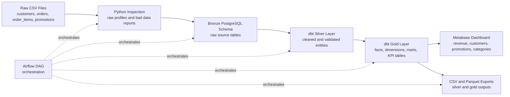

# End-to-End ELT Retail Analytics Platform

An end-to-end retail data platform that turns raw ecommerce CSV files into trusted analytics tables, automated quality reports, Metabase dashboards, and CSV/Parquet exports. The project demonstrates a modern ELT workflow using PostgreSQL, dbt, Airflow, Docker, Python, Pandas, SQLAlchemy, and Metabase.

## Project Overview

Retail teams often rely on disconnected files, inconsistent promotion tracking, and manually refreshed dashboards. This project solves that problem by building a reproducible analytics platform that ingests raw retail data, validates quality issues, models business-ready datasets, and publishes metrics for decision makers.

The platform was built to answer practical business questions:

- Which customers generate the most revenue, and how recently have they purchased?
- Which promotions are producing attributed revenue and efficient budget usage?
- Which order channels perform best by revenue, order volume, and customer reach?
- Which product categories are strongest, and how much revenue is promotion-driven?
- Where does source data contain duplicates, invalid dates, missing relationships, or unreliable attribution?

This platform would be used by data engineers, analytics engineers, marketing analysts, finance teams, ecommerce leaders, and recruiters evaluating end-to-end data engineering capability.

## Architecture Overview

This project uses an ELT architecture: raw data is loaded into the warehouse first, then transformed inside PostgreSQL with dbt. That choice keeps ingestion simple, preserves the original source data for auditing, and lets transformation logic live in version-controlled SQL models where it can be tested and documented.

It follows Medallion Architecture:

- Bronze preserves raw source data exactly as received.
- Silver cleans, standardizes, types, deduplicates, and validates records.
- Gold creates analytics-ready facts, dimensions, marts, and business KPI tables.



## Tech Stack

| Tool | Purpose | Why It Was Used |
| --- | --- | --- |
| PostgreSQL | Local analytical warehouse | Reliable relational database for schemas, SQL transformations, constraints, and Metabase connectivity |
| dbt | Silver and Gold transformations | Version-controlled analytics engineering, model lineage, tests, reusable macros, and documentation-ready SQL |
| Airflow | Workflow orchestration | Coordinates validation, ingestion, dbt runs, dbt tests, and export generation in a repeatable DAG |
| Docker | Reproducible deployment | Runs PostgreSQL, Airflow, dbt, and Metabase consistently across environments |
| Python | Pipeline automation | Handles raw inspection, bronze loading, export generation, and Metabase API automation |
| Pandas | CSV profiling and export handling | Efficient local processing for file inspection and output generation |
| SQLAlchemy | Database connectivity | Provides a maintainable Python interface for PostgreSQL loading and exports |
| Metabase | Business intelligence dashboard | Turns Gold tables into accessible KPI dashboards for non-technical users |
| CSV / Parquet | Analytical exports | Supports downstream sharing, local analysis, and efficient columnar data consumption |

## Data Sources

| Dataset | Grain | Key Columns | Business Meaning |
| --- | --- | --- | --- |
| `customers.csv` | One row per customer | `customer_id`, `email`, `registration_date`, `customer_segment`, `preferred_channel`, `income_level`, `promo_sensitivity`, opt-in flags, `preferred_category` | Customer profile, marketing preferences, segmentation attributes, and behavioral indicators |
| `orders.csv` | One row per order | `order_id`, `customer_id`, `order_date`, `order_status`, `promotion_id`, `order_channel`, `order_value`, `attributed_to_promo` | Transaction header data used for revenue, channel, promotion attribution, and customer purchase behavior |
| `order_items.csv` | One row per order line item | `order_item_id`, `order_id`, `product_id`, `product_category`, `quantity`, `unit_price`, `promotion_id`, `attributed_to_promo` | Product-level order detail used for category performance and item revenue analysis |
| `promotions.csv` | One row per marketing campaign | `promotion_id`, `campaign_name`, `promo_type`, `discount_value`, `start_date`, `end_date`, `target_segment`, `campaign_channel`, `budget_allocated`, `cost_per_acquisition` | Campaign metadata used to evaluate promotion performance, ROI, budget efficiency, and attribution quality |

## Project Workflow

### Step 1: Raw Data Inspection

`inspect_raw_data.py` profiles the source CSV files before loading them into the warehouse. It checks row counts, duplicate records, null values, malformed fields, invalid dates, negative or impossible numeric values, and promotion attribution issues. The outputs are written to `reports/raw_data_profile.json` and `reports/raw_bad_data_summary.csv`.

This step gives the engineering team visibility into source reliability before transformations begin.

### Step 2: Bronze Layer Ingestion

`load_bronze.py` loads the four raw CSV files into PostgreSQL under the `bronze` schema. The raw tables are stored without business transformations so the warehouse keeps an auditable copy of the original source data.

Bronze tables created:

- `bronze.customers_raw`
- `bronze.orders_raw`
- `bronze.order_items_raw`
- `bronze.promotions_raw`

### Step 3: Silver Transformations

dbt builds cleaned Silver models from the Bronze sources. Silver logic standardizes text values, parses dates, converts numeric and boolean fields, deduplicates by business keys, validates relationships, nulls invalid optional references, and adds quality flags.

Silver tables are the trusted operational layer used by downstream Gold models.

### Step 4: Gold Analytics Marts

dbt builds Gold tables for analytical use cases. The Gold layer includes dimensional models, fact tables, marts, and executive-facing KPI tables. These models aggregate revenue, customer behavior, promotion performance, channel performance, and category performance.

### Step 5: Dashboard Generation

`create_metabase_dashboard.py` uses the Metabase API to connect to PostgreSQL and create dashboard cards automatically. The dashboard is based on dbt Gold models and includes executive metrics, trend charts, leaderboard tables, and customer/category/channel breakdowns.

### Step 6: Exports

`export_outputs.py` exports Silver and Gold tables into both CSV and Parquet formats. These outputs support local analysis, stakeholder sharing, and downstream consumption by tools that do not connect directly to PostgreSQL.

## Bronze Layer

The Bronze layer is the raw landing zone. Its purpose is to preserve source data exactly as received, including dirty values, missing fields, duplicates, inconsistent strings, and malformed dates.

No transformations occur in Bronze because raw preservation is important for:

- Auditing what was received from source systems
- Reprocessing data if business rules change
- Comparing cleaned records back to original values
- Investigating data quality issues without losing context

Bronze tables:

| Table | Source File | Purpose |
| --- | --- | --- |
| `bronze.customers_raw` | `data/customers.csv` | Raw customer profile and segmentation data |
| `bronze.orders_raw` | `data/orders.csv` | Raw order headers and promotion attribution fields |
| `bronze.order_items_raw` | `data/order_items.csv` | Raw order line item and product category data |
| `bronze.promotions_raw` | `data/promotions.csv` | Raw campaign metadata, budget, and date fields |

## Silver Layer

The Silver layer creates clean, typed, deduplicated, relationship-aware tables. These models are still close to the source business entities, but they are reliable enough for analytics.

### `silver_customers`

- Grain: one row per `customer_id`.
- Purpose: trusted customer profile table for segmentation and customer 360 analytics.
- Transformations: trims and standardizes text, lowercases email, normalizes names, parses registration and last purchase dates, converts opt-in fields to booleans, casts order and value fields to numeric types, standardizes segment/channel/category values, and deduplicates by customer.
- Data quality checks: unique and non-null customer IDs, accepted values for segment/channel/age/income/category, invalid phone flags, missing last purchase flags, and invalid registration date flags.

### `silver_orders`

- Grain: one row per `order_id`.
- Purpose: trusted order header table for revenue, channel, status, promotion, and customer behavior analysis.
- Transformations: parses order dates, converts order values to numeric, normalizes order status and channel, converts attribution values to booleans, validates customer relationships, validates promotion references, and deduplicates by order.
- Data quality checks: unique and non-null order IDs, customer relationship validation, optional promotion relationship validation, invalid order value flags, missing promotion flags, promotion-attributed-without-promotion flags, and invalid promotion reference flags.

### `silver_order_items`

- Grain: one row per `order_item_id`.
- Purpose: trusted line-item table for product, category, quantity, price, and promo-attributed item revenue analysis.
- Transformations: casts IDs, quantities, and unit prices, standardizes product categories, calculates `item_revenue` and `line_total`, validates order relationships, validates promotion references, and deduplicates by order item.
- Data quality checks: unique and non-null order item IDs, required order relationship validation, accepted product categories, invalid quantity flags, invalid unit price flags, missing promotion attribution flags, and invalid promotion reference flags.

### `silver_promotions`

- Grain: one row per `promotion_id`.
- Purpose: trusted promotion dimension for campaign analysis, ROI evaluation, and attribution checks.
- Transformations: standardizes promotion type, target segment, campaign channel, campaign objective, and target category; parses start and end dates; casts budget, discount, response rate, and CPA fields; and deduplicates by promotion.
- Data quality checks: unique and non-null promotion IDs, accepted campaign attributes, invalid date range flags, negative discount flags, invalid response rate flags, invalid budget flags, and valid date range indicators.

### `data_quality_report`

- Grain: one row per detected issue type and table.
- Purpose: centralized quality reporting table for pipeline observability and stakeholder transparency.
- Transformations: aggregates issue counts from raw and Silver validations.
- Data quality checks: non-null issue metadata and accepted severity levels of `low`, `medium`, and `high`.

## Gold Layer

The Gold layer is designed for business consumption. It includes dimensional models (`dim_customer`, `dim_product`, `dim_promotion`, `dim_date`), fact models (`fact_orders`, `fact_order_items`), analytical marts, and KPI-focused Gold tables.

### `gold_customer_360`

- Grain: one row per customer.
- Metrics generated: total orders, paid orders, cancelled orders, total revenue, actual average order value, first order date, last order date, promo orders, non-promo orders, promo revenue, non-promo revenue, preferred purchased category, recency days, and lifecycle segment.
- Business use cases: customer segmentation, retention analysis, lifecycle marketing, high-value customer identification, promo sensitivity analysis, and customer health reporting.

### `gold_promotion_performance`

- Grain: one row per promotion.
- Metrics generated: paid orders, total customers, total revenue, total items sold, average order value, attributed orders, attributed revenue, estimated CPA, revenue per budget, campaign status, and promotion validity flags.
- Business use cases: campaign ROI analysis, budget efficiency review, promotion leaderboard reporting, target segment analysis, and campaign quality monitoring.

### `gold_channel_performance`

- Grain: one row per channel.
- Metrics generated: paid orders, revenue, promo orders, promo revenue, unique customers, average order value, number of campaigns, and total allocated campaign budget.
- Business use cases: channel mix analysis, marketing channel effectiveness, customer acquisition planning, and budget allocation decisions.

### `gold_category_performance`

- Grain: one row per product category.
- Metrics generated: items sold, item revenue, unique orders, unique customers, and promo-attributed revenue.
- Business use cases: category performance analysis, merchandising decisions, promotion/category alignment, and revenue contribution reporting.

## Data Quality Framework

Data quality is treated as a first-class part of the pipeline because unreliable source data can create misleading revenue, promotion, and customer insights. The project uses both Python-based raw inspection and dbt-based model testing.

Validation rules include:

- Duplicate checks for business keys such as `customer_id`, `order_id`, `order_item_id`, and `promotion_id`
- Null checks for required identifiers and issue reporting fields
- Accepted value checks for customer segments, channels, statuses, categories, campaign objectives, and lifecycle segments
- Invalid date checks for customer dates, order dates, promotion start/end dates, and campaign date ranges
- Numeric checks for revenue, quantity, unit price, discount value, budget, response rate, and CPA fields
- Promotion attribution checks for records marked as promo-attributed without a usable `promotion_id`
- Relationship checks between orders and customers, order items and orders, and optional promotion references
- Aggregated data quality reporting through `silver.data_quality_report`

The design preserves as much useful data as possible. Rows are excluded only when they cannot satisfy required grain or required foreign-key constraints. Optional invalid promotion references are nulled and flagged so revenue facts remain usable while attribution issues remain visible.

## Dashboard

The Metabase dashboard is generated programmatically from Gold-layer SQL queries. It is designed for business users who need to understand sales performance, customer value, promotion effectiveness, and product category performance without writing SQL.

Dashboard KPIs and pages include:

| Area | Dashboard Content | Business Question Answered |
| --- | --- | --- |
| Revenue KPIs | Total paid revenue, revenue goal progress, revenue and orders over time, daily revenue trend | How is the business performing overall and over time? |
| Promotion KPIs | Promo-attributed revenue, promotion ROI leaderboard, attributed revenue, revenue per budget | Which promotions are generating measurable return? |
| Customer KPIs | Total customers, customer segment value, revenue by income level, promo sensitivity distribution, top customers by revenue | Which customer groups drive the most value? |
| Channel KPIs | Revenue by order channel, orders by channel, promo revenue by channel | Which acquisition and order channels perform best? |
| Category KPIs | Product category performance, items sold, category revenue, promo-attributed category revenue | Which categories contribute the most revenue and promo lift? |

## Project Structure

```text
retail-data-platform/
|-- airflow/
|   `-- dags/
|       `-- retail_pipeline_dag.py
|-- data/
|   |-- customers.csv
|   |-- orders.csv
|   |-- order_items.csv
|   `-- promotions.csv
|-- docker/
|   `-- postgres/
|       `-- init/
|           `-- 01_create_retail_schemas.sql
|-- macros/
|   |-- cleaning.sql
|   `-- generate_schema_name.sql
|-- models/
|   |-- sources.yml
|   |-- silver/
|   |   |-- customers.sql
|   |   |-- orders.sql
|   |   |-- order_items.sql
|   |   |-- promotions.sql
|   |   |-- data_quality_report.sql
|   |   `-- schema.yml
|   `-- gold/
|       |-- dim_customer.sql
|       |-- dim_date.sql
|       |-- dim_product.sql
|       |-- dim_promotion.sql
|       |-- fact_orders.sql
|       |-- fact_order_items.sql
|       |-- mart_customer_summary.sql
|       |-- mart_daily_sales.sql
|       |-- mart_product_category_performance.sql
|       |-- mart_promotion_performance.sql
|       |-- gold_customer_360.sql
|       |-- gold_promotion_performance.sql
|       |-- gold_channel_performance.sql
|       |-- gold_category_performance.sql
|       `-- schema.yml
|-- outputs/
|   |-- silver/
|   `-- gold/
|-- reports/
|   |-- raw_bad_data_summary.csv
|   `-- raw_data_profile.json
|-- tests/
|   `-- no_negative_revenue.sql
|-- create_metabase_dashboard.py
|-- docker-compose.airflow.yml
|-- export_outputs.py
|-- inspect_raw_data.py
|-- load_bronze.py
|-- dbt_project.yml
|-- profiles.yml.example
|-- requirements.txt
`-- README.md
```

| File or Folder | Description |
| --- | --- |
| `data/` | Source CSV files used as the raw retail dataset |
| `reports/` | Raw profiling and bad data reports generated before loading |
| `models/silver/` | dbt models that clean, type, deduplicate, and validate source entities |
| `models/gold/` | dbt dimensions, facts, marts, and business-facing KPI tables |
| `macros/` | Reusable dbt cleaning macros for parsing, standardization, and schema generation |
| `tests/` | Custom dbt data tests for business rules such as non-negative revenue |
| `outputs/silver/` | Exported Silver tables in CSV and Parquet format |
| `outputs/gold/` | Exported Gold tables in CSV and Parquet format |
| `airflow/dags/` | Airflow DAG that orchestrates the end-to-end pipeline |
| `docker/postgres/init/` | PostgreSQL schema bootstrap SQL |
| `inspect_raw_data.py` | Profiles source files and generates raw data quality reports |
| `load_bronze.py` | Loads raw CSV files into the Bronze PostgreSQL schema |
| `export_outputs.py` | Exports Silver and Gold warehouse tables to CSV and Parquet |
| `create_metabase_dashboard.py` | Creates Metabase dashboard cards through the Metabase API |
| `docker-compose.airflow.yml` | Local Docker deployment for Airflow, PostgreSQL, dbt, and Metabase |

## Running the Project

## Pull Request Workflow

Use a separate Git branch for every project change so `main` stays stable.

Example workflow:

```powershell
git checkout main
git pull origin main
git checkout -b feature/your-change-name
git status
git add .
git commit -m "Describe your change"
git push -u origin feature/your-change-name
```

After pushing, open the GitHub repository and create a pull request from your feature branch into `main`.

### Run With Airflow and Docker

```powershell
docker compose -f docker-compose.airflow.yml up airflow-init
docker compose -f docker-compose.airflow.yml up
```

Open Airflow at `http://localhost:8080` with `admin` / `admin`, then trigger the `retail_data_platform` DAG.

The DAG runs:

1. CSV source validation
2. Raw data inspection
3. Bronze loading
4. dbt dependency preparation
5. dbt Silver and Gold model execution
6. dbt tests
7. CSV and Parquet exports

### Run dbt With Docker

```powershell
docker compose -f docker-compose.airflow.yml run --rm dbt dbt run --profiles-dir .
docker compose -f docker-compose.airflow.yml run --rm dbt dbt test --profiles-dir .
```

### Run Locally

```powershell
python -m venv venv
venv\Scripts\python.exe -m pip install -r requirements.txt
venv\Scripts\python.exe inspect_raw_data.py
venv\Scripts\python.exe load_bronze.py
venv\Scripts\dbt.exe run --profiles-dir .
venv\Scripts\dbt.exe test --profiles-dir .
venv\Scripts\python.exe export_outputs.py
```

## Key Engineering Concepts Demonstrated

- ELT: raw data is loaded first, then transformed in the warehouse using dbt.
- Medallion Architecture: the project separates raw ingestion, trusted cleaning, and business-ready analytics into Bronze, Silver, and Gold layers.
- Data Warehousing: PostgreSQL schemas, facts, dimensions, marts, and KPI tables create an analytical warehouse structure.
- Dimensional Modeling: customer, product, promotion, and date dimensions support fact models and marts.
- Data Quality Management: raw profiling, dbt tests, relationship validation, business rule checks, and quality flags make data issues visible.
- Analytics Engineering: dbt models convert source entities into documented, testable, reusable analytics assets.
- Workflow Orchestration: Airflow coordinates the full pipeline from CSV validation through exports.
- Dashboard Automation: Metabase dashboards are created through code, reducing manual BI setup and improving reproducibility.

## Challenges and Solutions

| Challenge | Solution |
| --- | --- |
| Bad source data | Added raw profiling, Silver quality flags, and dbt tests so data issues are measurable instead of hidden |
| Missing promotion IDs | Preserved non-promo orders, flagged promo-attributed records without promotion IDs, and avoided false attribution |
| Invalid dates | Parsed dates defensively, retained records when possible, and exposed invalid registration and campaign date flags |
| Data validation | Used dbt accepted values, non-null tests, unique tests, relationship tests, and custom business tests |
| Reproducibility | Containerized the platform with Docker and automated execution through Airflow |
| Business usability | Modeled Gold tables around revenue, customer, promotion, channel, and category questions instead of only technical source structures |

## Future Improvements

- Add incremental loading for larger datasets and recurring ingestion windows.
- Implement SCD Type 2 dimensions for customer segment, income level, and promotion metadata changes.
- Deploy to a cloud warehouse such as BigQuery, Snowflake, Redshift, or Azure Synapse.
- Add CI/CD for dbt runs, tests, documentation generation, and Docker validation.
- Add data observability with freshness checks, anomaly detection, lineage monitoring, and alerting.
- Add source freshness tests and pipeline SLAs in Airflow.
- Add semantic layer definitions for consistent metric governance.
- Add role-based access controls for production analytics users.
