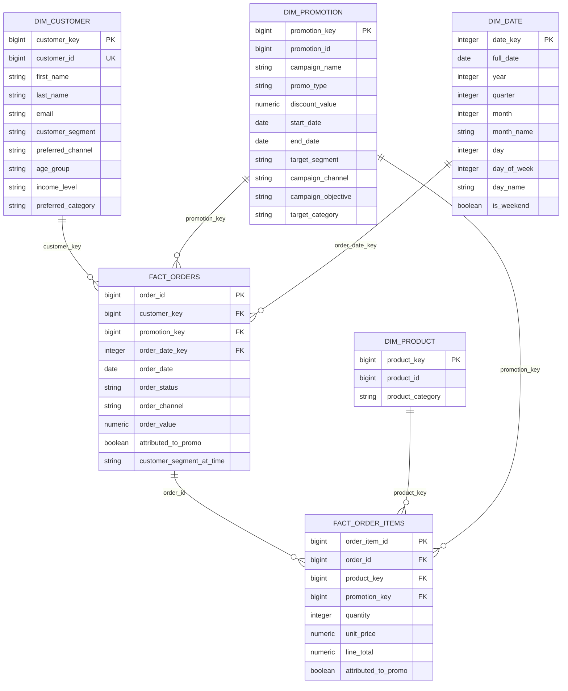

# Gold Dimensional Model ERD

This ERD shows the core Gold layer dimension and fact tables.

## Relationship Summary

| From table | Column | To table | Column | Relationship |
|---|---|---|---|---|
| `fact_orders` | `customer_key` | `dim_customer` | `customer_key` | Many orders per customer |
| `fact_orders` | `promotion_key` | `dim_promotion` | `promotion_key` | Many orders per promotion |
| `fact_orders` | `order_date_key` | `dim_date` | `date_key` | Many orders per date |
| `fact_order_items` | `order_id` | `fact_orders` | `order_id` | Many items per order |
| `fact_order_items` | `product_key` | `dim_product` | `product_key` | Many order items per product |
| `fact_order_items` | `promotion_key` | `dim_promotion` | `promotion_key` | Many order items per promotion |

Note: these are logical primary and foreign keys validated by dbt tests, not physical PostgreSQL constraints.
